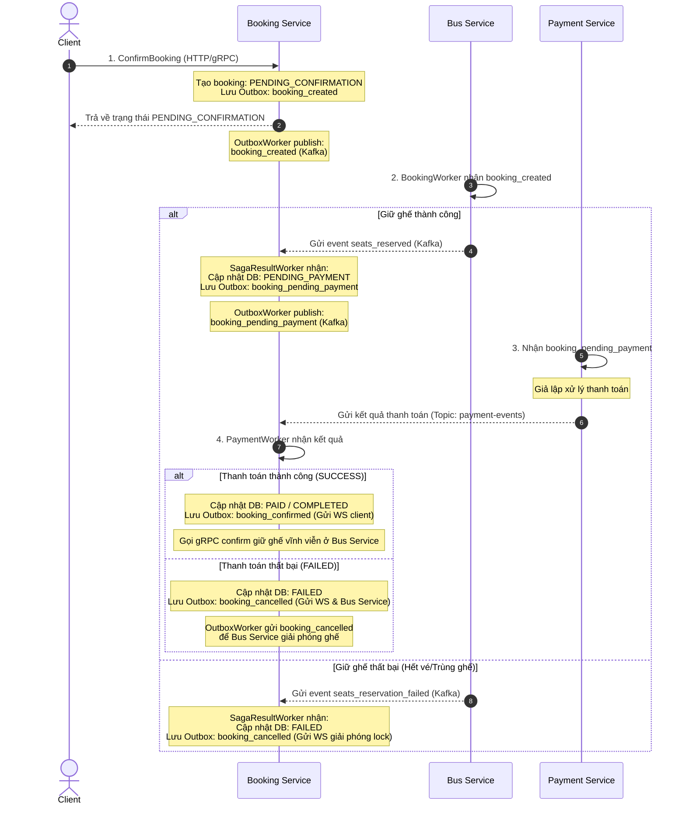

Edited main.go
Edited main.go
Edited main.go
Viewed kafka%20payment%20migration.md:72-85

Chính xác rồi bạn! Dưới đây là mô hình chi tiết từng bước của luồng đi (flow) hiện tại để bạn dễ hình dung và lưu lại:

### Các trạng thái và sự kiện đi kèm:

1. **Đặt vé ban đầu**:
   - DB Booking: `PENDING_CONFIRMATION`.
   - Sự kiện Kafka phát đi: `booking_created` (Header `event_type`).
2. **Xác nhận giữ ghế bất đồng bộ**:
   - Nếu thành công:
     - DB Booking chuyển thành: `PENDING_PAYMENT`.
     - Sự kiện Kafka phát đi: `booking_pending_payment`.
   - Nếu thất bại:
     - DB Booking chuyển thành: `FAILED`.
     - Sự kiện Kafka phát đi: `booking_cancelled` (để thông báo Client qua WebSocket hủy vé).
3. **Thanh toán**:
   - `payment-service` lắng nghe sự kiện `booking_pending_payment`, xử lý xong gửi phản hồi qua topic `payment-events`.
   - `booking-service` nhận kết quả thanh toán:
     - Thành công: Chuyển thành `PAID` và gửi request gRPC cập nhật ghế vĩnh viễn bên Bus Service.
     - Thất bại: Chuyển thành `FAILED` và gửi sự kiện `booking_cancelled` để Bus Service hủy giữ ghế và hoàn lại ghế trống.
