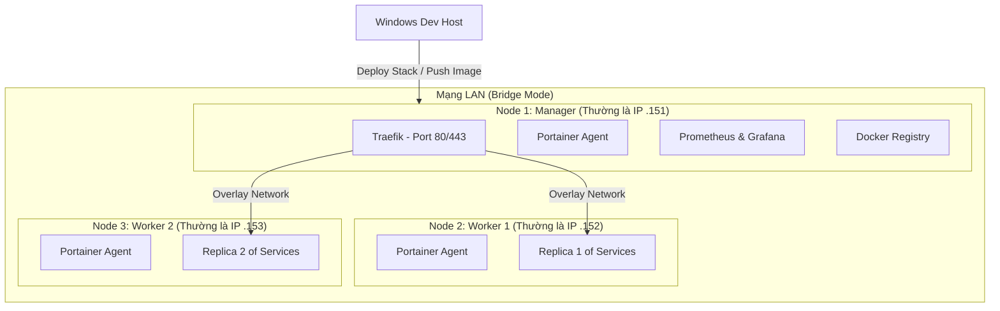

Lựa chọn **Docker Swarm** là một bước đi cực kỳ sáng suốt! Đây là giải pháp Orchestration (điều phối container) có sẵn của Docker, nhẹ hơn Kubernetes rất nhiều nhưng vẫn cung cấp đầy đủ các tính năng: **Tự động cân bằng tải (Load Balancing)**, **Tự động phát hiện lỗi và khôi phục (Self-healing)**, và **Scale ứng dụng dễ dàng**.

Với mô hình 3 Node (1 Manager, 2 Workers), chúng ta sẽ có kiến trúc như sau:



---

## 📋 Lộ trình cập nhật cho Docker Swarm (3 Nodes)

### Bước 1: Chuẩn bị 3 Máy ảo (VMs)
1. **Tạo 3 VM Ubuntu Server:**
   * **Node 1 (Manager):** Đặt tên `swarm-manager-1` (RAM 2-3GB, 2 CPU).
   * **Node 2 (Worker):** Đặt tên `swarm-worker-1` (RAM 1-2GB, 1 CPU).
   * **Node 3 (Worker):** Đặt tên `swarm-worker-2` (RAM 1-2GB, 1 CPU).
2. **Cấu hình Network Bridge & Static IP:** Đảm bảo cả 3 máy ảo thông mạng với nhau và thông với máy host Windows. Ví dụ:
   * Manager IP: `192.168.1.151`
   * Worker 1 IP: `192.168.1.152`
   * Worker 2 IP: `192.168.1.153`
3. Cài đặt Docker trên cả 3 máy ảo.

---

### Bước 2: Thiết lập Cluster Docker Swarm
1. **Khởi tạo Swarm trên Node Manager (`swarm-manager-1`):**
   ```bash
   docker swarm init --advertise-addr 192.168.1.151
   ```
   Lệnh này sẽ trả về một chuỗi token có dạng: `docker swarm join --token SWMTKN-... 192.168.1.151:2377`.
2. **Join các Worker:** Copy chuỗi token đó chạy trên `swarm-worker-1` và `swarm-worker-2` để kết nối chúng vào cluster.
3. **Kiểm tra trên Manager:** Gõ `docker node ls` để thấy cả 3 node đều ở trạng thái `Ready`.

---

### Bước 3: Cấu hình Traefik & Portainer ở chế độ Swarm
* **Traefik Swarm Mode:** Khác với Docker thường, Traefik sẽ lắng nghe Docker Socket ở chế độ Swarm để tự động phát hiện các Service đang chạy trên các node khác thông qua mạng ảo **Overlay Network** (`traefik-public`).
* **Portainer Agent:** Portainer sẽ chạy ở dạng Agent (chạy trên cả 3 node) để giúp em đứng từ Manager quản lý được container trên cả 2 Worker.

---

### Bước 4: Viết File Docker Stack (`docker-stack.yml`)
Khi deploy ứng dụng lên Swarm, ta không dùng `docker-compose up` nữa mà dùng `docker stack deploy`. Cấu hình scale 3 replica (mỗi node chạy 1 bản) sẽ được định nghĩa trực tiếp trong file:
```yaml
deploy:
  replicas: 3
  placement:
    max_replicas_per_node: 1 # Rải đều mỗi node chạy tối đa 1 replica
  restart_policy:
    condition: on-failure
```

---

### Bước 5: Cấu hình Monitoring cho cả 3 Node
* **Node Exporter (Global Service):** Chúng ta sẽ chạy Node Exporter dưới dạng `global` service trong Swarm. Docker sẽ tự động cài và chạy 1 bản Node Exporter trên **mọi node** mới gia nhập cluster.
* **Prometheus & Grafana:** Prometheus chạy trên Manager, cấu hình để tự động cào (scrape) metrics từ Node Exporter của cả 3 node và hiển thị lên Grafana dashboard.

---

### 🚀 Nhiệm vụ đầu tiên của em:
1. Tạo 3 máy ảo Ubuntu Server trên VMware.
2. Cài Docker lên cả 3 máy ảo đó.
3. Khởi tạo Docker Swarm và kết nối chúng lại với nhau.

Khi em gõ `docker node ls` trên máy Manager và thấy hiển thị đủ 3 nodes, hãy chụp hoặc gửi kết quả cho anh nhé, ta sẽ đi tiếp bước thiết lập mạng Overlay và cài đặt Traefik + Portainer Swarm!