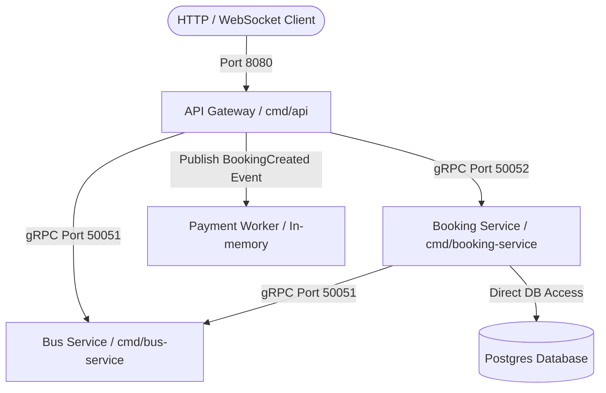

# Hướng Dẫn Tách Booking & Bus Service Thành gRPC Service (Bước 3) — ĐÃ HOÀN THÀNH ✅

Kế hoạch di chuyển (Migration Plan) của **Bước 3: Tách Booking Service thành gRPC Service** và mở rộng tách rời hoàn toàn **Bus Service** đã được thực hiện thành công và chạy ổn định.

---

## 1. Kiến Trúc Sau Khi Di Chuyển (Target Architecture)

Các dịch vụ hiện đã được phân tách thành các tiến trình chạy độc lập, giao tiếp với nhau thuần gRPC qua mạng:



### Các Cổng Dịch Vụ (Service Ports)
* **API Gateway** (`cmd/api`): Cổng HTTP `8080` / Cổng WebSocket.
* **Bus Service** (`cmd/bus-service`): Cổng gRPC `50051`.
* **Booking Service** (`cmd/booking-service`): Cổng gRPC `50052`.

---

## 2. Các Thành Phần Đã Triển Khai (Completed Tasks)

### 2.1. Protobuf & Code Generation
* **File `.proto`**: Cập nhật `proto/bus/v1/bus.proto` bổ sung đầy đủ các RPC cho quản trị và giao diện HTTP của Bus (`CreateBus`, `ListBuses`, `GetSeats`, `DeleteBus`).
* **Công Cụ Biên Dịch**: Tạo script Go (`scripts/gen_proto.go`) biên dịch chéo nền tảng (Windows, macOS, Linux), cập nhật `Makefile` để chạy `make gen-proto`.

### 2.2. Bus Service (gRPC + DB Access)
* **gRPC Server** (`internal/bus/delivery/grpc/server.go`): Implement đầy đủ các RPC mới, gọi trực tiếp tầng Usecase của Bus.
* **Entrypoint** (`cmd/bus-service/main.go`): Khởi chạy gRPC Server độc lập trên cổng `:50051`.

### 2.3. Booking Service (gRPC + Client Bus)
* **gRPC Server** (`internal/booking/delivery/grpc/server.go`): Nhận các request đặt vé, gọi usecase và map các domain error sang mã lỗi gRPC Status.
* **Entrypoint** (`cmd/booking-service/main.go`): Khởi chạy gRPC Server độc lập trên cổng `:50052` và kết nối gRPC client sang Bus Service (`:50051`).

### 2.4. API Gateway (HTTP Clients only)
* **HTTP Booking Handler** (`internal/booking/delivery/http/handler.go`): Gọi Booking Service qua gRPC Client cổng `:50052`, map lỗi trả về và phát sự kiện `BookingCreated` in-memory cục bộ để Payment Worker ở Gateway xử lý.
* **HTTP Bus Handler** (`internal/bus/delivery/http/handler/bus.go`): Chuyển đổi toàn bộ code gọi usecase cục bộ sang gọi gRPC Client cổng `:50051` và giải nén (unpack) response để giữ cấu trúc JSON tương thích với UI.
* **Entrypoint** (`cmd/api/main.go`): Loại bỏ các khởi tạo database/usecase của Bus & Booking, chỉ khởi tạo các gRPC client kết nối đến 2 service.

---

## 3. Cách Vận Hành & Khởi Chạy (Commands)

Chúng ta đã tạo các lệnh tắt tiện lợi trong `Makefile`:

* **Khởi chạy API Gateway** (Port 8080):
  ```bash
  make dev-api-gateway
  ```
* **Khởi chạy Bus Service** (Port 50051):
  ```bash
  make dev-bus-service
  ```
* **Khởi chạy Booking Service** (Port 50052):
  ```bash
  make dev-booking-service
  ```

---

## 4. Các Bước Tiếp Theo (Next Steps for Step 4)
* **Phân tách Database**: Phân chia schema database Postgres thành 2 cơ sở dữ liệu riêng biệt cho Bus và Booking để đảm bảo tính cô lập dữ liệu hoàn toàn.
* **Tích Hợp Kafka**: Thay thế cơ chế phát event `BookingCreated` in-memory ở Gateway bằng cách đẩy event trực tiếp lên Kafka topic từ Booking Service và có Payment Service riêng biệt consume để thanh toán.
