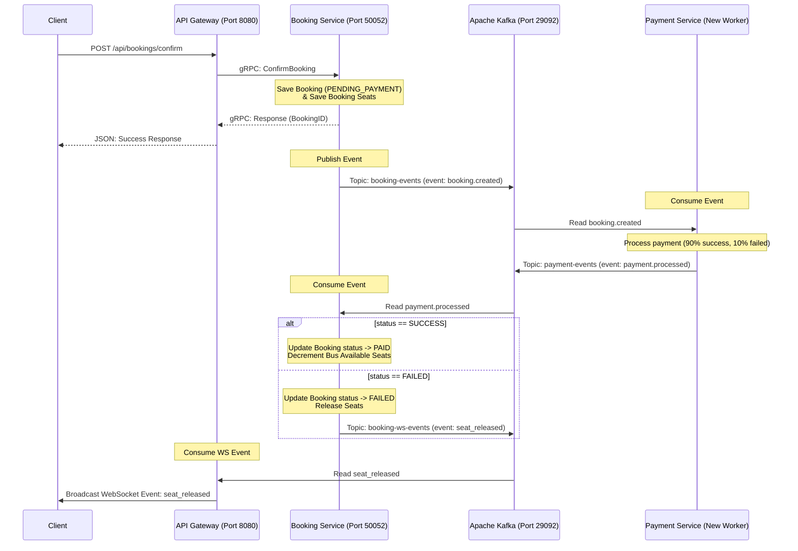

# Hướng Dẫn Tích Hợp Kafka Cho Thanh Toán (Bước 4)

Trong bước này, chúng ta sẽ thay thế cơ chế truyền thông điệp Payment in-memory (sử dụng Go channel cục bộ) bằng **Apache Kafka**.

---

## 1. Thiết Kế Luồng Đi (Event Choreography Flow)

---

## 2. Kế Hoạch Triển Khai Step-by-Step

Để thực hiện bước này một cách dễ hiểu nhất, chúng ta sẽ chia thành các phần nhỏ:

### Bước 4.1: Cấu hình Kafka trong `.env` và `configs`

- Thêm biến môi trường `KAFKA_BROKERS` vào `.env` và `.env-example`.
- Khai báo thêm cấu hình Kafka trong `configs/config.go`.

### Bước 4.2: Tạo helper khởi tạo Kafka Writer/Reader

- Tạo thư mục `pkg/kafka/` và file `pkg/kafka/client.go` để cung cấp các hàm khởi tạo Producer (Writer) và Consumer (Reader) bằng thư viện `github.com/segmentio/kafka-go`.

### Bước 4.3: Viết Kafka Event Publishers cho Booking Service

- Tạo `internal/booking/event/kafka_payment_publisher.go` để implement interface `confirmbooking.PaymentEventPublisher` nhằm gửi sự kiện `booking.created` lên Kafka.
- Tạo `internal/booking/event/kafka_ws_publisher.go` để implement interface `ports.EventPublisher` nhằm gửi các sự kiện WebSocket (`seat_locked`, `seat_released`) lên Kafka.

### Bước 4.4: Tạo Payment Service Độc Lập

- Tạo file `cmd/payment-service/main.go`: Đóng vai trò là một microservice độc lập không có DB, chỉ consume sự kiện `booking.created`, giả lập xử lý thanh toán, rồi đẩy trạng thái thanh toán lên topic `payment-events`.

### Bước 4.5: Cập nhật Booking Service để nhận kết quả thanh toán

- Cập nhật `cmd/booking-service/main.go` để:
  - Khởi tạo `HandlePaymentSuccessUsecase` với các adapter cục bộ và `KafkaWSEventPublisher`.
  - Khởi chạy một Goroutine chạy ngầm (Consumer) tiêu thụ topic `payment-events` để gọi Usecase cập nhật DB khi thanh toán thành công/thất bại.
  - Thay thế PaymentPublisher in-memory bằng `KafkaBookingPublisher`.

### Bước 4.6: Cập nhật API Gateway

- Cập nhật `cmd/api/main.go` để:
  - Loại bỏ việc tự chạy `PaymentWorker` và `DLQWorker` in-memory.
  - Khởi chạy một Goroutine chạy ngầm (Consumer) tiêu thụ topic `booking-ws-events` để chuyển tiếp sự kiện và broadcast qua WebSocket Hub tới client.

---

Bạn hãy xem qua kế hoạch này. Nếu bạn đã sẵn sàng, chúng ta sẽ bắt đầu ngay với **Bước 4.1: Cấu hình Kafka** nhé!
