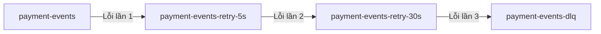

## 1. Bản Chất Khác Biệt Giữa RabbitMQ và Kafka

| Đặc tính | RabbitMQ (Queue-based) | Kafka (Log-based) |
| :--- | :--- | :--- |
| **Cơ chế quản lý** | Tin nhắn được xóa khỏi Queue ngay khi nhận được `ACK`. | Tin nhắn được lưu vĩnh viễn trong Log. Tiến trình đọc được quản lý bằng **Offset** (con trỏ chỉ mục). |
| **Khi gửi `Nack`** | Tin nhắn quay lại Queue (thường là lên đầu hàng đợi) để gửi lại. | **Không có khái niệm `Nack`**. Bạn chỉ có thể chọn: Commit offset hoặc không Commit offset. |
| **Hệ quả của lỗi** | Nếu tin nhắn bị lỗi liên tục, nó sẽ quay vòng vô hạn (Poison Message) rất nhanh. | Nếu bạn không Commit offset, Consumer sẽ bị **kẹt** tại tin nhắn đó và không thể đọc các tin nhắn tiếp theo (Head-of-Line Blocking). |

---

## 2. RabbitMQ có tự động Backoff khi `Nack` không?

**Không.** Trong RabbitMQ tiêu chuẩn, nếu bạn `Nack` và đặt `requeue=true`, RabbitMQ sẽ gửi lại tin nhắn đó **ngay lập tức** (tần suất cực kỳ nhanh), dẫn đến việc CPU/RAM tăng vọt và tràn log nếu lỗi là vĩnh viễn (như lỗi cú pháp DB).

Để triển khai **Backoff** trong RabbitMQ, người ta phải kết hợp:
1.  **DLX (Dead Letter Exchange) + Queue TTL:** Khi consume lỗi, bạn `Nack` với `requeue=false`. Tin nhắn được đưa sang một **Retry Queue** có cấu hình thời gian sống (TTL - ví dụ 10 giây). Khi hết 10 giây, RabbitMQ tự chuyển tin nhắn đó ngược lại Queue chính để consume lại.
2.  **Plugin Delayed Message:** Dùng plugin để trì hoãn việc phân phối tin nhắn.

---

## 3. Đánh Giá Code Hiện Tại Của Bạn (In-Memory Retry)

Cách bạn đang code (dùng vòng lặp `for` và `time.Sleep` nhân đôi thời gian ở mỗi lần lỗi) được gọi là **In-Memory Retry (Blocking Retry)**.

### **Ưu điểm:**
*   **Đơn giản, trực quan:** Không cần tạo thêm Queue/Topic trung gian hay cấu hình hạ tầng phức tạp.
*   **Đảm bảo thứ tự tuyệt đối (Strict Ordering):** Phù hợp với Kafka. Nếu Booking $A$ bị lỗi, hệ thống sẽ dừng lại để xử lý cho xong Booking $A$ rồi mới sang Booking $B$. Việc này cực kỳ quan trọng cho các nghiệp vụ cần đúng tuần tự.

### **Nhược điểm:**
*   **Gây nghẽn luồng (Blocking):** Trong thời gian `time.Sleep(backoff)`, Consumer của bạn hoàn toàn bị block, không thể nhận thêm bất kỳ tin nhắn mới nào khác từ partition đó.
*   **Dễ bị Rebalance (Với Kafka):** Nếu tổng thời gian retry và sleep của bạn vượt quá cấu hình `max.poll.interval.ms` của Kafka (mặc định thường là 5 phút), Kafka Coordinator sẽ nghĩ Consumer này đã chết và kích hoạt **Rebalance**, dẫn đến việc gián đoạn xử lý.

---

## 4. Hướng Triển Khai Backoff Không Nghẽn (Non-blocking Retry)

Nếu bạn muốn hệ thống có throughput cao (không bị nghẽn tin nhắn sau khi tin nhắn trước bị lỗi), bạn nên triển khai **Non-blocking Retries** bằng cách tạo các **Retry Topics/Queues**.

### Cách hoạt động (Ví dụ với 3 lần retry):
1.  **Topic chính (`payment-events`):** Consumer đọc tin nhắn. Nếu lỗi lần 1, **Commit offset** trên topic chính ngay lập tức để giải phóng luồng, nhưng publish tin nhắn đó sang Topic Retry 1 (`payment-events-retry-5s`).
2.  **Topic Retry 1 (`payment-events-retry-5s`):** Consumer của topic này sẽ delay 5 giây trước khi xử lý lại. Nếu tiếp tục lỗi, publish sang Topic Retry 2 (`payment-events-retry-30s`) và commit offset tại Retry 1.
3.  **Topic Retry 2 (`payment-events-retry-30s`):** Delay 30 giây. Nếu vẫn lỗi, gửi sang **DLQ** (`payment-events-dlq`) để xử lý thủ công.

### **Lời khuyên từ Mentor:**
*   Nếu hệ thống của bạn có **lượng tải vừa phải** và nghiệp vụ **yêu cầu thứ tự nghiêm ngặt** (ví dụ: vé xe phải được xử lý đúng tuần tự để tránh tranh chấp ghế), **giữ nguyên code in-memory retry của bạn** là phương án an toàn và đơn giản nhất. Chỉ cần lưu ý điều chỉnh `max.poll.interval.ms` của Kafka đủ lớn để tránh bị Rebalance.
*   Nếu hệ thống cần **throughput lớn**, không quan trọng thứ tự và không muốn một transaction lỗi làm nghẽn toàn bộ hàng đợi, hãy áp dụng mô hình **Non-blocking Retry Topics** nêu trên.