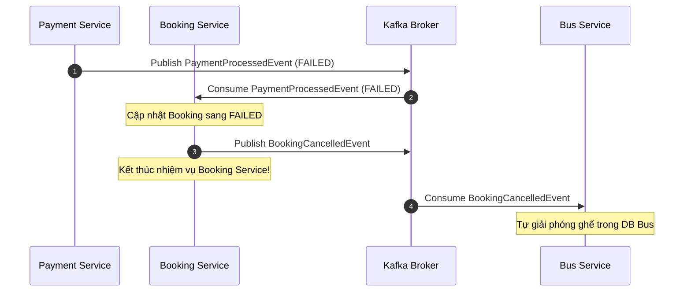

Tiếp tục với **Choreography-based Saga (Phương án 2)**, đây là mô hình thiết kế tối ưu nhất cho giao tiếp giữa các Microservices khi cần thực hiện các giao dịch phân tán (Distributed Transactions) mà không muốn các service bị ràng buộc cứng (tight coupling) bởi các cuộc gọi API đồng bộ (gRPC/REST).

Dưới đây là thiết kế chi tiết và các bước triển khai cụ thể cho mô hình Saga trong hệ thống Bus Booking của chúng ta.

---

## I. Nguyên Lý Hoạt Động Của Saga trong Luồng Hủy Vé

Thay vì **Booking Service** phải chủ động đi gọi **Bus Service** để giải phóng ghế, luồng đi của sự kiện sẽ được đảo ngược (Event-Driven):

