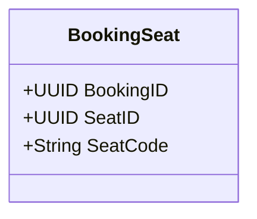
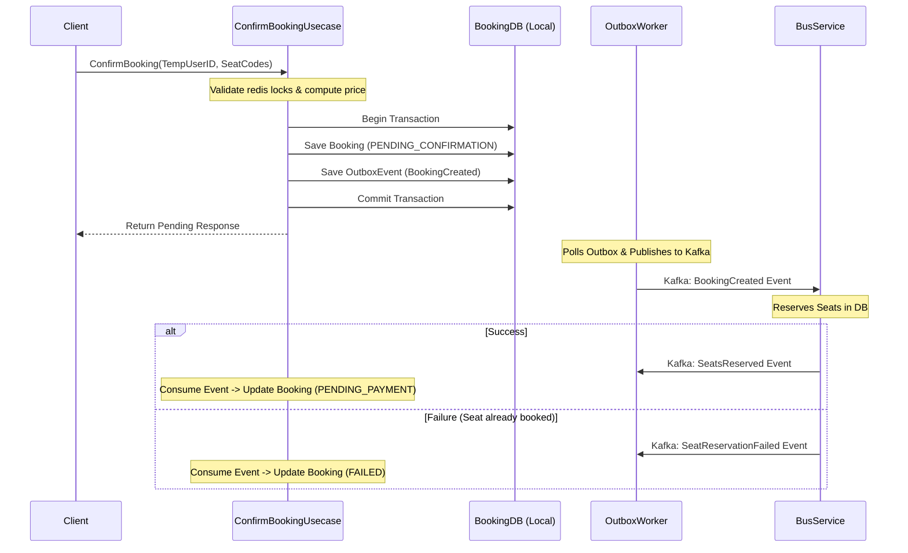

# Saga Pattern & Transaction Clean Code Refactoring Plan

This document outlines the architectural assessment and step-by-step refactoring plan to resolve database transaction boundary violations in the **Bus Booking System**.

---

## 1. Executive Summary & Problem Statement

Currently, the booking system wraps several external gRPC calls (network I/O) within database transactions. This is a critical anti-pattern in distributed systems:

1. **Database Connection Exhaustion**: Network calls (gRPC to `bus-service` and `user-service`) are slow and unpredictable. Holding database connections open while waiting for network responses quickly exhausts the connection pool under load.
2. **Data Inconsistency / Dual-Write Problem**: If the local database transaction rolls back *after* an external gRPC call completes successfully (e.g., booking seats or creating users), the external service remains in a mutated state while the local state is reverted, resulting in silent data corruption.
3. **Tight Coupling**: The `booking-service` cannot function or complete transactions if downstream services are temporarily offline or slow.

To achieve production-grade resilience, we must enforce **strict database transaction boundaries**:
* Database transactions **MUST ONLY** persist local database changes and save outbox events.
* All external interactions (mutations & non-local data retrieval during state transition) must be performed either **before** the transaction starts or **asynchronously** via the **Transactional Outbox Pattern** (Choreography Saga).

---

## 2. Current State Assessment

### Usecase 1: `ConfirmBookingUsecase`
* **File**: `internal/booking/usecase/confirm_booking/usecase.go`
* **DB Transaction Block** (lines 134–231):
  * ❌ `u.busProvider.BookSeats(...)`: gRPC call to mutate seat status in `bus-service`.
  * ❌ `u.userPort.FindByPhone(...)`: gRPC query to check user existence in `user-service`.
  * ❌ `u.userPort.Create(...)` / `Update(...)`: gRPC call to save user profile.
* **Impact**: If any step fails after `BookSeats`, seats remain booked but no booking record exists.

### Usecase 2: `HandlePaymentUsecase.Success` & `Failed`
* **File**: `internal/booking/usecase/handle_payment/usecase.go`
* **DB Transaction Block** (lines 48–76 & lines 101–156):
  * ❌ `u.busProvider.GetSeatByBookingID(...)`: gRPC call to retrieve seat list.
  * ❌ `u.busProvider.MarkBookedByBookingID(...)` (in `Success`): gRPC call to update seat status.
* **Impact**: Unnecessary network overhead and lock-holding inside local transaction.

### Usecase 3: `ExpireBookingUsecase`
* **File**: `internal/booking/usecase/expire_booking/usecase.go`
* **DB Transaction Block** (lines 42–96):
  * ❌ `u.busProvider.GetSeatByBookingID(...)`: gRPC call to fetch seats.
* **Impact**: Unnecessary network overhead inside local transaction.

---

## 3. Proposed Architecture & Refactoring Plan

### Phase 1: Local Data Autonomy (Eliminating gRPC Reads)
Currently, `booking-service` relies on `bus-service` via gRPC to retrieve the seats associated with a booking (`GetSeatByBookingID`). We can make the service self-sufficient by duplicating the `seat_code` in the local `booking_seats` table.

1. **Database Migration**:
   * Add `seat_code VARCHAR(10) NOT NULL` to the `booking_seats` table.
2. **Domain/Repository Update**:
   * Add `SeatCode` field to `bookingDomain.BookingSeat`.
   * Update `postgresRepository.BookingSeatRepository` to save and load `seat_code`.
3. **Usecase Refactoring**:
   * When creating a booking, save both `SeatID` and `SeatCode` locally.
   * In `ExpireBookingUsecase` and `HandlePaymentUsecase`, retrieve the seat codes directly from the local database instead of making a gRPC call.

---

### Phase 2: User Service Decoupling
User registration should not block the booking transaction.
1. **Pre-Transaction Execution**:
   * Move the gRPC calls `userPort.FindByPhone`, `userPort.Create`, and `userPort.Update` **out** of the transaction block (execute them *before* calling `u.tx.Execute`).
   * Since users are persistent resources, registering a user before a booking starts is perfectly safe, even if the subsequent booking fails.

---

### Phase 3: Choreography Saga for Seat Booking

Instead of synchronously booking seats inside the transaction, we transition to an asynchronous **Choreography-based Saga** using the **Transactional Outbox Pattern**.

#### Step-by-Step Execution:
1. **State Transition**:
   * Introduce a new state: `PENDING_CONFIRMATION` (or keep `PENDING_PAYMENT` but handle asynchronous failures).
2. **Transaction Isolation**:
   * **Write Local First**: In `ConfirmBookingUsecase`, save the Booking and Outbox records locally in the transaction. Do NOT call `BookSeats` via gRPC.
3. **Async Processing in `bus-service`**:
   * Create a Kafka consumer in `bus-service` that listens to `BookingCreatedEvent`.
   * Upon receiving the event, `bus-service` attempts to reserve the seats.
   * If successful, it publishes `SeatsReservedEvent`. If it fails, it publishes `SeatsReservationFailedEvent`.
4. **Compensation Logic in `booking-service`**:
   * `booking-service` listens to these Kafka events:
     * On `SeatsReservedEvent`: Update booking status to `PENDING_PAYMENT` (allowing the user to pay).
     * On `SeatsReservationFailedEvent`: Update booking status to `FAILED`, release local locks, and notify the user via WebSocket.

---

## 4. Summary of Code Refactoring Tasks

| Target Component | Current Issue | Refactored State |
| :--- | :--- | :--- |
| `ConfirmBookingUsecase` | gRPC `BookSeats` & `UserService` inside transaction. | User API called first. Seat booking delegated to Kafka Outbox Event. |
| `BookingSeat` Table & Model | Only stores IDs. Forces gRPC calls to get seat codes. | Added `seat_code` column. Fully autonomous queries. |
| `HandlePaymentUsecase` | gRPC `GetSeatByBookingID` & `MarkBooked` inside transaction. | Read seat codes locally. Publish `BookingPaidEvent` to Outbox. |
| `ExpireBookingUsecase` | gRPC `GetSeatByBookingID` inside transaction. | Read seat codes locally. Publish `BookingCancelledEvent` to Outbox. |
