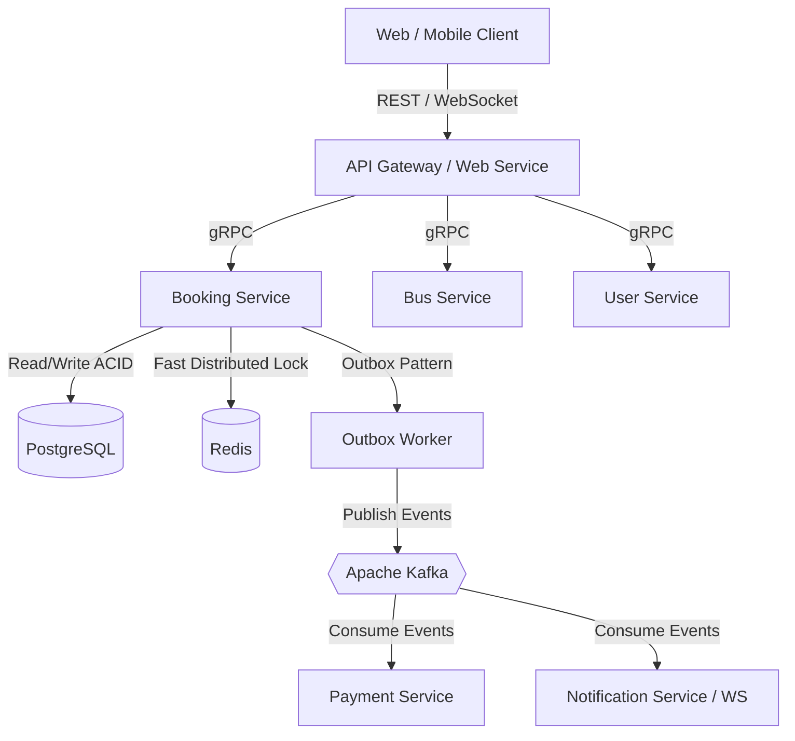

# Tổng Quan Kiến Trúc, Công Nghệ & Kỹ Thuật Dự Án Bus Booking System

Tài liệu này tổng hợp toàn bộ danh mục **Công nghệ (Tech Stack)**, **Kiến trúc (Architecture)** và các **Pattern nâng cao** được sử dụng trong hệ thống Đặt Vé Xe Khách (`booking-system`), kèm theo phân tích chuyên sâu về **tính hợp lý** của từng quyết định thiết kế.

---

## 1. Tổng Quan Kiến Trúc (Architecture Overview)

- **Miền bài toán (Domain)**: Hệ thống đặt vé xe khách theo thời gian thực (Real-time Bus Booking System) xử lý các bài toán giữ ghế tạm thời, đặt vé, thanh toán bất đồng bộ và phát sự kiện thời gian thực.
- **Mô hình kiến trúc**: **Event-Driven Microservices Architecture** kết hợp với **Clean Architecture / Domain-Driven Design (DDD)**.



---

## 2. Danh Mục Công Nghệ (Tech Stack) & Lý Do Sử Dụng

| Công nghệ / Library                                    | Vai trò trong hệ thống                    | Tính hợp lý & Giá trị mang lại                                                                                                                                                                                                                                                                |
| :----------------------------------------------------- | :---------------------------------------- | :-------------------------------------------------------------------------------------------------------------------------------------------------------------------------------------------------------------------------------------------------------------------------------------------- |
| **Go (Golang)**                                        | Ngôn ngữ chính cho toàn bộ Microservices  | • Hiệu năng xử lý cực cao với chi phí RAM/CPU thấp.<br>• **Goroutine** siêu nhẹ (vài KB) hỗ trợ hàng chục ngàn kết nối giữ ghế và WebSocket đồng thời.<br>• Biên dịch ra 1 file binary duy nhất, khởi động nhanh, tối ưu hóa cho Docker/Kubernetes container.                                 |
| **PostgreSQL & GORM**                                  | Cơ sở dữ liệu chính (Relational DB)       | • Cung cấp **ACID Transactions** đảm bảo tính toàn vẹn tuyệt đối cho dữ liệu đặt vé và dòng tiền.<br>• Hỗ trợ **Row-Level Locking (`FOR UPDATE SKIP LOCKED`)** phục vụ Outbox Pattern.<br>• Hỗ trợ kiểu dữ liệu `JSONB` cho cột `payload` của sự kiện Outbox.                                 |
| **Redis (`go-redis/v9`)**                              | In-Memory Data Store & Distributed Lock   | • Latency **dưới 1 miligiây (sub-millisecond)** phù hợp cho tính năng giữ ghế tức thì (Flash Sale / Cao điểm).<br>• Hỗ trợ **Key Expiration (TTL)** giúp tự động nhả ghế khi hết thời gian giữ chỗ (ví dụ: 10 phút).<br>• Giảm tải hơn 95% thao tác đọc/ghi vào Database PostgreSQL chính.    |
| **Apache Kafka (`segmentio/kafka-go`)**                | Message Broker / Event Streaming Platform | • Truyền nhận sự kiện bất đồng bộ giữa các Microservices (Booking, Payment, Notification).<br>• Hỗ trợ **Partition Keying**: Đảm bảo thứ tự FIFO tuyệt đối cho các event của cùng một đơn vé.<br>• Khả năng chịu tải cực lớn (High Throughput) và lưu vết sự kiện (Event Sourcing potential). |
| **gRPC & Protocol Buffers (`google.golang.org/grpc`)** | Giao tiếp đồng bộ giữa các Microservices  | • Truyền dữ liệu dạng **Binary Proto** mã hóa nhỏ gọn qua kết nối **HTTP/2 Multiplexing** cho độ trễ cực thấp.<br>• Schema hợp đồng rõ ràng (`.proto`), tự động gen code type-safe cho Go, giảm rủi ro sai lệch dữ liệu giữa các service.                                                     |
| **Gin Framework & Gorilla WebSocket**                  | HTTP API Gateway & Real-time Broadcasting | • **Gin**: Framework HTTP nhanh nhẹn, routing tối ưu cho API.<br>• **Gorilla WebSocket**: Push trạng thái sơ đồ ghế realtime (ghế vừa bị giữ / đã thanh toán / vừa nhả) tới tất cả các client đang xem.                                                                                       |
| **Prometheus & Grafana (`prometheus/client_golang`)**  | Monitoring & Observability                | • Đo lường chỉ số **RED (Rate, Errors, Duration)** cho các gRPC unary interceptors và HTTP endpoints.<br>• Theo dõi sức khỏe hệ thống theo thời gian thực.                                                                                                                                    |

---

## 3. Các Design Pattern & Kỹ Thuật Nâng Cao Đã Áp Dụng

### 3.1. Clean Architecture (Hexagonal Architecture / Ports & Adapters)

- **Cấu trúc phân tầng**:
  ```text
  cmd/               <-- Entrypoints khởi tạo ứng dụng
  internal/booking/
  ├── delivery/      <-- Adapters (HTTP, gRPC, Worker)
  ├── usecase/       <-- Core Business Logic & Orchestration
  ├── domain/        <-- Entities & Enterprise Business Rules
  ├── ports/         <-- Interfaces định nghĩa hợp đồng
  └── dto/          <-- Data Transfer Objects
  pkg/               <-- Repositories & Infrastructures (Postgres, Redis, Kafka)
  ```
- **Lý do hợp lý**:
  - Tách biệt hoàn toàn **Business Logic** khỏi các framework hay cơ sở dữ liệu bên ngoài.
  - Dễ dàng viết Unit Test bằng Mock Interfaces (như `SeatLockPort`, `EventPublisher`).
  - Có thể linh hoạt thay đổi DB hoặc Message Broker mà không làm sửa đổi bất kỳ code usecase nào.

---

### 3.2. Transactional Outbox Pattern (Cải tiến với `FOR UPDATE SKIP LOCKED`)

- **Bản chất**:
  Khi người dùng xác nhận đặt vé, thông tin Booking và Outbox Event được lưu trong **CÙNG MỘT DB Transaction** (`u.tx.Execute`). Sau đó, một **Outbox Worker** chạy nền sẽ fetch sự kiện từ DB và publish lên Kafka.
- **Các cải tiến kỹ thuật đã áp dụng**:
  1. **`FOR UPDATE SKIP LOCKED`**: Đảm bảo khi scale-up nhiều instance của Outbox Worker, các worker sẽ không bao giờ nhặt trùng event của nhau (ngăn ngừa Duplicate Event Publishing).
  2. **Retry Limit & Status `FAILED`**: Nếu gửi Kafka lỗi, worker ghi nhận `retry_count` và `last_error`. Khi retry vượt quá 5 lần, event được chuyển sang `FAILED` tránh bị lặp vô hạn (Infinite Loop).
  3. **Auto Cleanup**: Tự động dọn dẹp event `PROCESSED` quá 24 giờ và event `FAILED` quá 7 ngày.
- **Lý do hợp lý**:
  Giải quyết triệt để vấn đề **Dual-Write Problem** (ghi DB thành công nhưng gửi Kafka thất bại hoặc ngược lại) mà không cần dùng đến 2PC Distributed Transactions nặng nề.

---

### 3.3. Distributed Lock Pattern (Redis `setnx` & Lock-First Order)

- **Bản chất**:
  Sử dụng `SeatLockRepo` và `BookingLockRepo` thao tác trên Redis với nguyên lý `setnx` (Set if Not Exists) + TTL.
- **Cải tiến kỹ thuật**:
  - **Lock-First Validation**: Thực hiện lock ghế trên Redis **TRƯỚC** khi thực hiện các câu query kiểm tra DB (`GetBus`, `GetSeatsByCodes`).
  - **Auto Rollback với `defer`**: Nếu bất kỳ bước kiểm tra DB nào thất bại (ví dụ: ghế đã có người đặt trước trong SQL DB), cơ chế `defer` sẽ tự động nhả Redis lock.
- **Lý do hợp lý**:
  Triệt tiêu rủi ro **Race Condition** khi nhiều người dùng cùng lúc bấm giữ 1 ghế. Giảm tải cho SQL DB vì các request đến sau sẽ bị ngắt ngay tại lớp Redis mà không làm quá tải Database.

---

### 3.4. Saga Pattern (Choreography/Orchestration via Kafka)

- **Bản chất**:
  Quản lý các giao dịch phân tán kéo dài (Long-running Distributed Transactions) qua nhiều Microservices (`Booking Service` $\rightarrow$ `Payment Service` $\rightarrow$ `Bus Service`).
- **Các sự kiện Saga**:
  - `BookingCreatedEvent` $\rightarrow$ Trạng thái `PENDING_CONFIRMATION`.
  - `PaymentProcessedEvent` / `SagaResult` $\rightarrow$ Chuyển trạng thái `PAID` hoặc thực hiện **Compensating Action** (hoàn tiền, hủy giữ ghế, đổi status `EXPIRED`/`CANCELLED`).
- **Lý do hợp lý**:
  Trong môi trường Microservices, các DB tách biệt hoàn toàn nên không thể dùng SQL Transaction thông thường. Saga là giải pháp chuẩn công nghiệp để đảm bảo tính **Eventual Consistency** (Nhất quán cuối cùng).

---

### 3.5. Non-blocking DLQ Retry Pattern (Kafka Dead Letter Queue)

- **Bản chất**:
  Trong `PaymentWorker`, khi nhận event từ Kafka:
  - Nếu là lỗi tạm thời (Transient error): Đẩy vào Retry Queue để thử lại.
  - Nếu là lỗi không thể phục hồi (Poison Pill / Bad Format Payload): Đẩy vào **DLQ Topic** (`payment-dlq-topic`) để ghi vết audit.
- **Lý do hợp lý**:
  Ngăn chặn một message lỗi làm tắc nghẽn (block) toàn bộ đường ống xử lý event của hàng ngàn người dùng khác.

---

### 3.6. Partition Key Ordering Strategy

- **Bản chất**:
  Mọi event gửi qua Kafka đều truyền `Key = []byte(bookingID.String())`.
- **Lý do hợp lý**:
  Kafka đảm bảo tính thứ tự **FIFO 100% trên từng Partition**. Việc đặt Key bằng `booking_id` giúp tất cả sự kiện của cùng một đơn vé (`Created` $\rightarrow$ `PendingPayment` $\rightarrow$ `Confirmed`) luôn đi vào cùng 1 Partition và được Consumer đọc theo đúng trình tự thời gian.

---

### 3.7. Kỹ Thuật Xử Lý Idempotency (Tính Đẳng Thức)

- **Bản chất**:
  Trong kiến trúc Microservices và Event Streaming (Kafka), các message broker chỉ đảm bảo **At-Least-Once Delivery** (tin nhắn có thể bị gửi lặp lại). Idempotency đảm bảo việc xử lý một request/event 1 lần hay nhiều lần đều cho ra kết quả giống nhau mà không gây hiệu ứng phụ (side-effect).
- **Các kỹ thuật áp dụng trong dự án**:
  1. **State Machine Validation**: Trong `HandlePaymentUsecase.Success` ([handle_payment/usecase.go](booking-system/internal/booking/usecase/handle_payment/usecase.go#L69)), kiểm tra `if booking.Status != "PENDING_PAYMENT" { return nil }`. Nếu event thanh toán bị lặp lại, hệ thống bỏ qua mà không xử lý lại.
  2. **Distributed Lock Prevention**: Dùng `AcquireConfirmLock` ngăn người dùng spam click nút Confirm Booking liên tục.
  3. **Unique Constraints**: Sử dụng Unique Index trong SQL DB ngăn việc tạo trùng bản ghi.

---

## 4. Tổng Kết

Dự án `booking-system` kết hợp hài hòa giữa **Tốc độ (Latency sub-ms của Redis)**, **Tính nhất quán dữ liệu (ACID của Postgres + Outbox Pattern)**, **Khả năng mở rộng (Scale-out bất đồng bộ của Kafka & Microservices)** và **Kiến trúc sạch (Clean Architecture)**. Đây là một bộ giải pháp kỹ thuật toàn diện, sẵn sàng cho các hệ thống tải cao thực tế.
