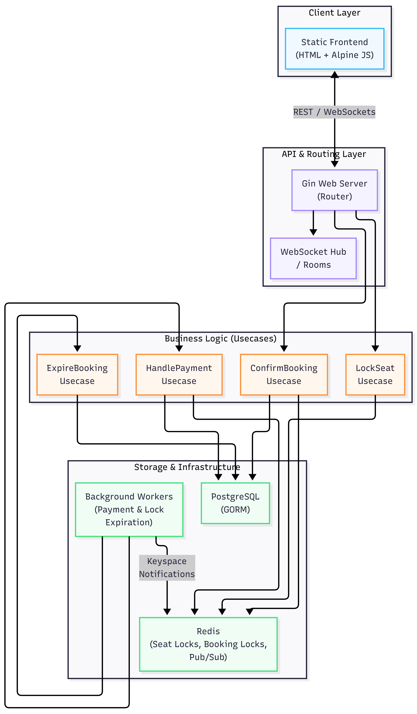
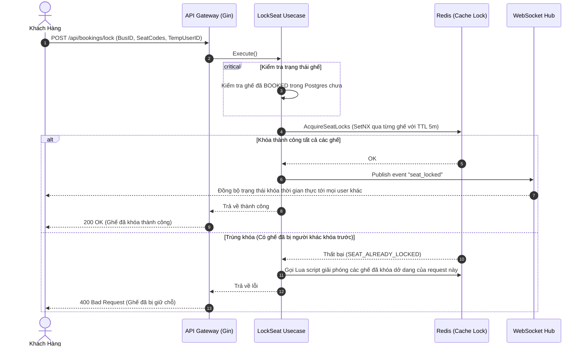
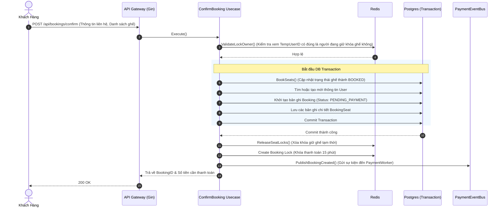
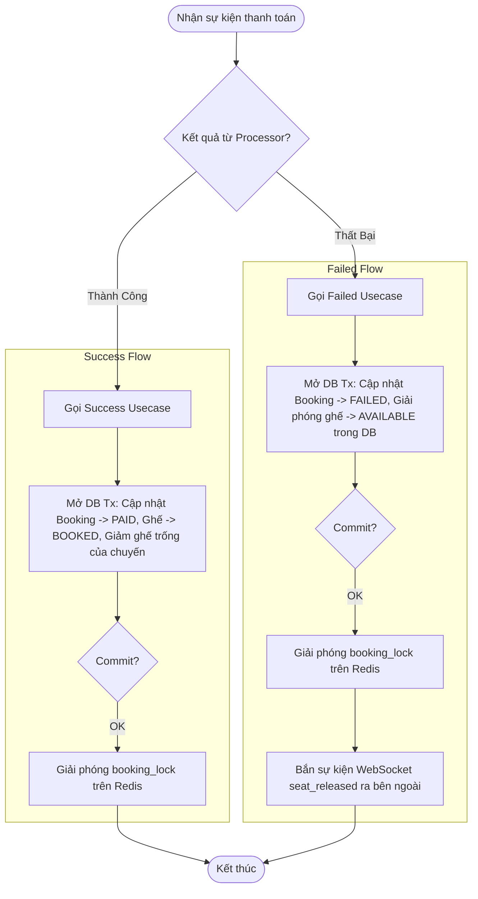
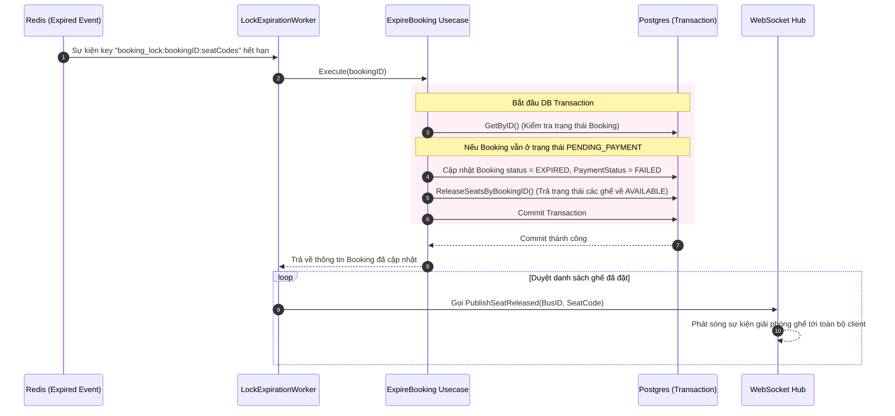

# Tài Liệu Thiết Kế & Vận Hành - Phiên Bản V1 (Monolith)

Tài liệu này mô tả chi tiết kiến trúc, các tính năng đã hoàn thiện, quy trình xử lý của các API quan trọng và các thành tựu kỹ thuật đạt được trong phiên bản **V1 (Modular Monolith)** của hệ thống Đặt Vé Xe Khách (Bus Booking System).

---

## 1. Tổng Quan Hệ Thống (Overview)

Phiên bản V1 được thiết kế dưới dạng **Modular Monolith** áp dụng mô hình **Clean Architecture (Hexagonal Architecture)**. Mục tiêu cốt lõi của V1 là xây dựng một nền tảng đặt vé xe khách có khả năng xử lý đồng thời tốt, đảm bảo tính nhất quán dữ liệu, đồng bộ hóa trạng thái ghế thời gian thực bằng WebSocket và tự động giải phóng ghế hết hạn qua Redis.

### Sơ Đồ Kiến Trúc Hệ Thống (System Architecture)

<!-- ```mermaid
graph TD
    subgraph Client Layer
        Web["Static Frontend (HTML + Alpine JS)"]
    end

    subgraph API & Routing Layer
        Gin["Gin Web Server (Router)"]
        WS["WebSocket Hub / Rooms"]
    end

    subgraph Business Logic
        LS["LockSeat Usecase"]
        CB["ConfirmBooking Usecase"]
        EB["ExpireBooking Usecase"]
        HP["HandlePayment Usecase"]
    end

    subgraph Storage & Infrastructure
        Redis["Redis (Seat Locks, Booking Locks, Pub/Sub)"]
        Postgres["PostgreSQL (GORM)"]
        Workers["Background Workers (Payment & Lock Expiration)"]
    end

    Web <-->|REST / WebSockets| Gin
    Gin --> WS
    Gin --> LS
    Gin --> CB
    
    LS --> Redis
    CB --> Postgres
    CB --> Redis
    
    Workers -->|Keyspace Notifications| Redis
    Workers --> EB
    Workers --> HP
    
    EB --> Postgres
    HP --> Postgres
    HP --> Redis
``` -->

## 2. Những Thứ Đã Làm Được (Completed Features)

### 2.1. Quản Lý Chuyến Xe & Sơ Đồ Ghế (Bus & Seat Management)
* Khởi tạo chuyến xe kèm cấu hình số lượng ghế, lịch trình và giá vé.
* Lấy thông tin chi tiết và sơ đồ trạng thái ghế (`AVAILABLE`, `LOCKED`, `BOOKED`).
* Sử dụng **Redis Batch Query (MGet)** để kiểm tra trạng thái khóa của toàn bộ ghế trong chuyến xe chỉ với 1 network round-trip, tối ưu hóa hiệu năng đáng kể (giải quyết lỗi N+1 Query).

### 2.2. Khóa Ghế Tạm Thời (Temporary Seat Locking)
* Người dùng được cấp một mã định danh tạm thời (`TempUserID`).
* Hệ thống hỗ trợ khóa nhiều ghế cùng lúc bằng **Redis Distributed Lock (SetNX)** với thời gian hết hạn mặc định (TTL) là **5 phút**.
* Đảm bảo tính nguyên tử (Atomicity) khi khóa và giải phóng khóa bằng tập lệnh **Lua Script** trên Redis (tránh tình trạng User A xóa nhầm lock của User B).

### 2.3. Quy Trình Xác Nhận & Thanh Toán (Booking & Payment Workflow)
* **Xác nhận đặt vé (Confirm Booking):** Xác thực chủ sở hữu khóa ghế, tính toán tổng tiền, lưu trữ thông tin đặt vé vào database qua Transaction, giải phóng khóa giữ ghế tạm thời trên Redis và khởi tạo khóa thanh toán mới (`booking_lock`) có hiệu lực **15 phút**.
* **Xử lý thanh toán bất đồng bộ (Asynchronous Payment):** Một `PaymentWorker` chạy nền lắng nghe sự kiện tạo booking và xử lý thanh toán thông qua bộ xử lý giả lập (`FakePaymentProcessor`).
* **Hoàn tất thanh toán:** Cập nhật trạng thái vé và giải phóng khóa Redis tương ứng một cách an toàn bên ngoài database transaction.

### 2.4. Tự Động Thu Hồi Ghế Hết Hạn (Booking Expiration)
* Lắng nghe sự kiện hết hạn khóa thông qua kênh **Redis Keyspace Notifications (`__keyevent@0__:expired`)**.
* Một `LockExpirationWorker` chạy nền sẽ tự động kích hoạt tiến trình hủy vé (`ExpireBookingUsecase`) và hoàn trả trạng thái ghế về `AVAILABLE` trong cơ sở dữ liệu nếu giao dịch không hoàn tất thanh toán đúng hạn.

---

## 3. Luồng Chi Tiết Trong Từng API Quan Trọng

### 3.1. API Khóa Ghế (`POST /api/bookings/lock`)
Được gọi khi người dùng click chọn ghế trên giao diện.



### 3.2. API Xác Nhận Đặt Vé (`POST /api/bookings/confirm`)
Được gọi khi người dùng điền thông tin cá nhân và click "Xác nhận đặt vé".



### 3.3. Luồng Xử Lý Thanh Toán (Thành Công & Thất Bại)
Khi `PaymentWorker` nhận được sự kiện thanh toán từ Cổng thanh toán (giả lập), tiến trình xử lý diễn ra như sau:



### 3.4. Luồng Tự Động Hủy Vé Khi Hết Hạn (Lock Expiration)
Nếu người dùng khóa ghế hoặc xác nhận đặt vé nhưng không thanh toán trong thời hạn quy định (15 phút).



---

## 4. Thành Tựu Đạt Được (Achievements)

1. **Transaction Safety (An Toàn Giao Gịch):**
   * Quản lý transaction trong tầng Usecase một cách trong suốt thông qua Go Context (`context.Context`), không làm lộ chi tiết thư viện ORM (GORM) lên tầng nghiệp vụ.
   
2. **Distributed Consistency (Nhất Quán Phân Tán):**
   * Phối hợp chặt chẽ giữa trạng thái tạm thời trong Redis và trạng thái bền vững trong PostgreSQL.
   * Loại bỏ hoàn toàn lỗi dual-write nhờ việc di chuyển các tác vụ gọi mạng (Redis, Event Publish) ra ngoài block database transaction.

3. **Concurrency Control (Kiểm Soát Đồng Thời):**
   * Ngăn chặn tuyệt đối hiện tượng trùng lịch, đặt đúp vé (double booking) thông qua cơ chế khóa phân tán Redis có TTL.
   * Xử lý giải phóng khóa an toàn bằng Lua scripts có xác thực token người giữ khóa để tránh race condition xóa nhầm khóa của tiến trình khác.

4. **Realtime UX (Trải Nghiệm Thời Gian Thực):**
   * Sử dụng cơ chế phòng WebSocket theo từng mã xe (`BusID`), giúp client tự động đồng bộ hóa sơ đồ ghế mỗi khi có bất kỳ ai thao tác khóa ghế hoặc hủy vé mà không cần F5 trình duyệt.

5. **Resource Leak Prevention (Tránh Rò Rỉ Tài Nguyên):**
   * Thiết lập cơ chế tự động dọn dẹp bộ nhớ đệm và mở khóa ghế nhờ Keyspace Notifications của Redis, giải phóng ghế trống cho những khách hàng khác khi có giao dịch thất bại hoặc hết thời gian thanh toán.
