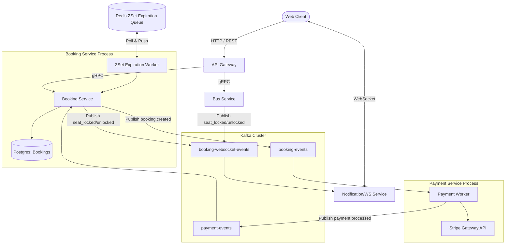

# Lộ Trình Cải Tiến Hệ Thống - Phiên Bản V2 Update

Tài liệu này chi tiết hóa kế hoạch triển khai của **Bước 5** trong lộ trình nâng cấp hệ thống (V2). Chúng ta sẽ giải quyết triệt để vấn đề ranh giới Domain của **Lock Expiration**, tách độc lập **Notification/WebSocket Service**, và nâng cấp **Payment Service** hỗ trợ tích hợp Stripe.

---

## 1. Trạng Thái Hiện Tại & Thách Thức

Sau khi hoàn thành Bước 4, hệ thống đã giao tiếp bất đồng bộ qua Kafka cho thanh toán và đồng bộ WebSocket. Tuy nhiên, vẫn còn 2 điểm yếu lớn về mặt kiến trúc:

1. **Ranh giới Domain bị vi phạm ở API Gateway:**
   - `lockExpirationWorker` và `expireBookingUsecase` đang được chạy trực tiếp tại API Gateway (`cmd/api/main.go`). API Gateway phải kết nối trực tiếp vào Postgres DB của Booking để cập nhật trạng thái hết hạn.
   - Cơ chế bắt sự kiện hết hạn hiện tại dựa trên **Redis Keyspace Notifications (`__keyevent@0__:expired`)**. Đây là cơ chế *At-most-once* (gửi và quên), nếu API Gateway bị restart đúng lúc key hết hạn, sự kiện hủy vé sẽ bị mất vĩnh viễn, dẫn đến treo ghế trong DB.

2. **WebSocket Hub chưa được tách rời:**
   - WebSocket Hub và `WsConsumer` vẫn đang chạy cùng tiến trình với API Gateway. Khi lượng người dùng truy cập đồng thời tăng cao, API Gateway sẽ bị quá tải RAM/CPU do phải duy trì hàng ngàn kết nối WebSocket lâu dài.

---

## 2. Kiến Trúc Mục Tiêu (Target Architecture)

Chúng ta sẽ tách WebSocket thành **Notification Service** độc lập và chuyển toàn bộ logic hủy vé hết hạn về **Booking Service** chạy nền bằng **Redis ZSet (Sorted Set)** làm Delay Queue đảm bảo tin cậy tuyệt đối (*At-least-once*).



---

## 3. Lộ Trình Triển Khai Chi Tiết (Implementation Roadmap)

### Phase 5.1: Tách Biệt WebSocket (Notification Service)
Chúng ta sẽ chuyển toàn bộ logic WebSocket ra khỏi API Gateway.

1. **Khởi tạo Notification Service:**
   - Tạo thư mục `cmd/notification-service/`.
   - Di chuyển `internal/booking/delivery/ws/` sang một package dùng chung hoặc khởi tạo trực tiếp trong `cmd/notification-service/` (do service này chỉ làm nhiệm vụ giao tiếp WebSocket).
2. **Cập nhật API Gateway:**
   - Xóa `ws.Hub`, `ws.NewWsConsumer` và router `/ws/buses/:id` khỏi `cmd/api/main.go`.
   - API Gateway chỉ giữ vai trò là stateless REST Gateway (routing HTTP request tới Bus Service và Booking Service).
3. **Cấu hình Client kết nối:**
   - Cập nhật frontend (`web/js/services/websocket.js`) kết nối trực tiếp tới cổng của Notification Service (ví dụ: `ws://localhost:8082/ws/buses/:id`) thay vị trí cũ ở API Gateway.

---

### Phase 5.2: Tái Cấu Trúc Lock Expiration & Redis ZSet Delay Queue
Chuyển logic hết hạn về đúng Booking Service và đảm bảo độ tin cậy.

1. **Chuyển code Expiration Worker:**
   - Di chuyển `lockExpirationWorker` và `expireBookingUsecase` từ `cmd/api/main.go` sang `cmd/booking-service/main.go`.
   - API Gateway không còn kết nối trực tiếp tới DB của Booking hay chứa logic liên quan đến DB Booking nữa.
2. **Implement Redis ZSet Delay Queue:**
   - Viết thư viện helper trong `pkg/redis` hỗ trợ:
     - `PushToDelayQueue(queueName string, id string, expireAt time.Time)`: Đẩy ID booking vào ZSet với score là timestamp hết hạn.
     - `PollFromDelayQueue(queueName string)`: Dùng script Lua hoặc lệnh `ZRANGEBYSCORE` để quét lấy ra các ID đã quá hạn và xử lý.
   - Khi Confirm Booking thành công, Booking Service sẽ đẩy `bookingID` vào ZSet thay vì chỉ tạo key Redis expire thông thường.
3. **Đảm bảo tính tin cậy (At-least-once):**
   - Delay Queue Worker của Booking Service sẽ poll liên tục từ ZSet.
   - Sau khi thực thi `expireBookingUsecase.Execute` cập nhật DB thành công và bắn event lên Kafka, lúc đó mới xóa ID booking khỏi ZSet. 
   - Nếu sập ứng dụng giữa chừng, dữ liệu trong ZSet vẫn còn nguyên và sẽ được xử lý tiếp khi app start lại.

---

## 4. Nâng Cấp Payment Service Thực Tế (Stripe Integration)
Thay thế bộ giả lập thanh toán (Fake Payment Processor) bằng tích hợp Stripe thực tế.

1. **Cấu hình Stripe Client:**
   - Đăng ký tài khoản Sandbox Stripe để lấy API Keys (`STRIPE_SECRET_KEY`).
   - Cài đặt Stripe Go SDK (`github.com/stripe/stripe-go/v72`).
2. **Luồng thanh toán nâng cấp:**
   - Khi nhận `BookingCreatedEvent`, Payment Service sẽ gọi API Stripe để tạo một **PaymentIntent** (hoặc tạo session Checkout Stripe và trả về URL cho client).
   - Client tiến hành thanh toán trên trang Stripe.
3. **Webhook Handler:**
   - Phát triển một API Webhook tại Payment Service để nhận callback từ Stripe khi giao dịch thành công/thất bại.
   - Webhook nhận event `charge.succeeded` hoặc `payment_intent.succeeded` từ Stripe, sau đó publish sự kiện tương ứng (`SUCCESS`/`FAILED`) lên Kafka topic `payment-events`.

---

## 4.5. Đảm Bảo Tính Nhất Quán Khi Thanh Toán Thất Bại (3 Phương Án)

Khi một giao dịch thanh toán thất bại (`PaymentProcessedEvent` có status `FAILED`), hệ thống cần thực hiện 2 thao tác:
1. Cập nhật trạng thái Booking thành `FAILED` (tại Booking Service).
2. Giải phóng ghế đã khóa (tại Bus Service).

Dưới đây là chi tiết thiết kế và hướng triển khai cho 3 phương án để xử lý đồng bộ/bất đồng bộ lỗi của một trong hai service này:

### Phương Án 1: Manual Commit + Retry & DLQ (Giải pháp Khắc phục Nhanh)
Phương án này giữ nguyên luồng điều phối đồng bộ (Booking Service gọi gRPC sang Bus Service) nhưng khắc phục lỗi mất dữ liệu do auto-commit của Kafka.

1. **Nguyên lý hoạt động:**
   - Tách cuộc gọi gRPC `busProvider.ReleaseSeatsByBookingID` ra khỏi block DB transaction `u.tx.Execute` của Booking Service để tránh giữ kết nối DB quá lâu.
   - Chuyển cấu hình Kafka Reader sang **Manual Commit** (`CommitInterval: 0`).
   - Chỉ commit offset Kafka khi và chỉ khi cả 2 bước (cập nhật DB Booking và gọi gRPC Bus Service thành công).
   - Nếu gọi gRPC sang Bus Service thất bại (mạng lỗi, Bus Service sập), Booking Service sẽ không commit message, thực hiện retry với exponential backoff.
   - Nếu sau $N$ lần retry vẫn lỗi, message sẽ được đưa vào **Dead Letter Queue (DLQ)** để giám sát và xử lý thủ công, tránh tắc nghẽn hàng đợi chính.

2. **Yêu cầu Idempotency:**
   - Hàm `ReleaseSeatsByBookingID` ở Bus Service và hàm cập nhật Booking ở Booking Service phải là idempotent (gọi nhiều lần với cùng 1 `booking_id` không gây ra lỗi hay sai lệch dữ liệu).

---

### Phương Án 2: Choreography-based Saga (Giải pháp Event-Driven Khuyên Dùng)
Decouple (hủy bỏ liên kết trực tiếp) hoàn toàn giữa Booking Service và Bus Service thông qua Event Broker (Kafka).

1. **Nguyên lý hoạt động:**
   - **Booking Service** lắng nghe `PaymentProcessedEvent` (`status = FAILED`).
   - Cập nhật trạng thái Booking cục bộ thành `FAILED` trong DB transaction của mình.
   - Khi cập nhật DB thành công, publish một event mới tên là `BookingCancelledEvent` (chứa `booking_id`, `bus_id`, danh sách ghế) lên Kafka topic `booking-events`.
   - **Bus Service** lắng nghe event `BookingCancelledEvent`. Khi nhận được event, nó tự thực hiện transaction giải phóng các ghế tương ứng trong DB của mình.
   
2. **Xử lý lỗi:**
   - Nếu Bus Service bị sập, event `BookingCancelledEvent` vẫn nằm an toàn trên Kafka. Khi Bus Service khởi động lại, nó sẽ tiếp tục tiêu thụ event và giải phóng ghế. Không cần cơ chế retry phức tạp ở phía Booking Service.

---

### Phương Án 3: Transactional Outbox Pattern (Đảm bảo Tin cậy 100% Giao dịch Cục bộ)
Giải pháp này giải quyết vấn đề: Booking Service cập nhật DB thành công nhưng bị sập ngay trước khi kịp gửi event hủy/gọi gRPC giải phóng ghế.

1. **Nguyên lý hoạt động:**
   - Thêm một bảng `outbox` vào DB của Booking Service:
     ```sql
     CREATE TABLE outbox (
         id UUID PRIMARY KEY,
         aggregate_type VARCHAR(255),
         aggregate_id VARCHAR(255),
         event_type VARCHAR(255),
         payload JSONB,
         status VARCHAR(50) DEFAULT 'PENDING',
         created_at TIMESTAMP DEFAULT CURRENT_TIMESTAMP
     );
     ```
   - Trong DB transaction hủy Booking, ghi thêm một bản ghi vào bảng `outbox` mô tả hành động cần thực hiện (ví dụ: giải phóng ghế). Do dùng chung một DB transaction cục bộ, hai hành động này đảm bảo cùng thành công hoặc cùng thất bại.
   - Một **Outbox Worker** chạy nền sẽ quét bảng `outbox` (hoặc dùng CDC/Debezium quét WAL log) tìm các event có `status = 'PENDING'`, thực hiện gọi gRPC sang Bus Service hoặc publish event tương ứng sang Kafka, sau đó cập nhật status thành `'PROCESSED'`.

---

## 5. Bảng Phân Chia Công Việc Dự Kiến

| Công việc | Vị trí thay đổi | Độ ưu tiên |
| :--- | :--- | :--- |
| **5.1.1** Khởi chạy `cmd/notification-service` | New Service | High |
| **5.1.2** Tách WS Hub ra khỏi API Gateway | `cmd/api/main.go` | High |
| **5.2.1** Chuyển `lockExpirationWorker` về Booking Service | `cmd/booking-service/main.go` | High |
| **5.2.2** Thay thế Redis Expire bằng ZSet Delay Queue | `pkg/redis`, `booking-service` | Critical |
| **5.3.1** Tích hợp Stripe SDK vào Payment Service | `cmd/payment-service` | Medium |
| **5.3.2** Viết Webhook API xử lý kết quả Stripe | `cmd/payment-service` | Medium |
| **5.4.1** Triển khai cơ chế Đảm bảo Nhất quán (Manual Commit / Saga / Outbox) | `booking-service`, `bus-service` | High |

